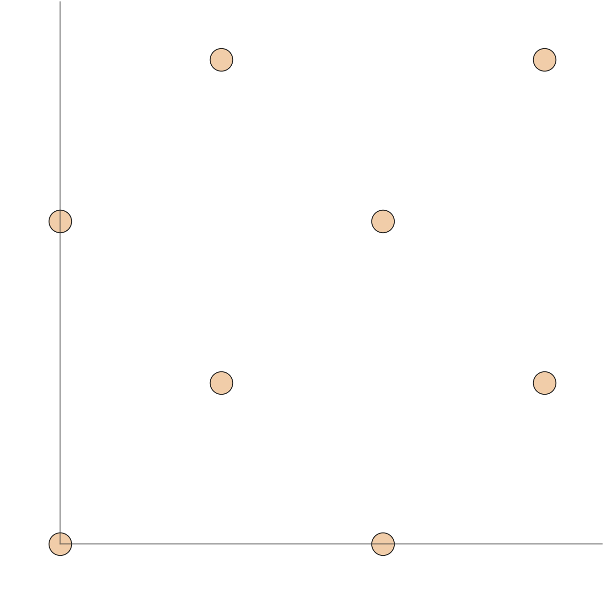

# CIF Structure Analysis

## Execution
- Status: `WARN`
- Manifest ID: `structure-99fb6c6c297f8407-b0`
- Schema version: `1.0`
- Input CIF label: `silicon-cod-9013102.cif`
- Input SHA-256: `99fb6c6c297f8407aa779de46bf7eaa663ac079f7f12b582c042313f9c82f77e`
- CIF syntax: `cif1.1`
- Parser: `gemmi 0.7.5` (strict-cif1.1)
- Selected data block: `9013102` (index 0)
- Script: `analyze_cif.py`
- ASE version: `3.29.0`

## Validation
- Overall validation: `warn`

| Check | Status | Message |
| --- | --- | --- |
| cif-document-parse | pass | parsed 1 CIF data block(s) with gemmi 0.7.5 |
| structure-adapter | pass | constructed an ASE structure from data block '9013102' at index 0 |
| cell-parameter-adapter-consistency | pass | raw CIF and ASE cell parameters agree within numeric tolerance |
| periodic-neighbor-search | pass | periodic-image neighbor search found at least one neighbor for every site |
| declared-detected-symmetry-mismatch | warn | CIF-declared symmetry does not match the symmetry detected from the selected structure at the requested tolerance |
| symmetry-dataset | pass | spglib detected Fd-3m (number 227) at symprec=0.001 |

## CIF Data Blocks
| Index | Name | Tags | Pairs | Loops |
| --- | --- | --- | --- | --- |
| 0 | 9013102 | 36 | 27 | 4 |

## Raw Cell Metadata
| Field | Tag | Raw | Value | Standard uncertainty |
| --- | --- | --- | --- | --- |
| a | _cell_length_a | 5.4304 | 5.4304 |  |
| b | _cell_length_b | 5.4304 | 5.4304 |  |
| c | _cell_length_c | 5.4304 | 5.4304 |  |
| alpha | _cell_angle_alpha | 90 | 90.0 |  |
| beta | _cell_angle_beta | 90 | 90.0 |  |
| gamma | _cell_angle_gamma | 90 | 90.0 |  |

## Computed Structure Facts
| Fact | Value | Artifact reference |
| --- | --- | --- |
| formula | Si8 | JSON: structure.formula |
| atom_count | 8 | JSON: structure.atom_count |
| element_counts | {"Si": 8} | JSON: structure.element_counts |
| cell_a_b_c_ang | 5.4304, 5.4304, 5.4304 | JSON: structure.cell |
| cell_angles_deg | 90.0, 90.0, 90.0 | JSON: structure.cell |
| volume_ang3 | 160.138391 | JSON: structure.volume_ang3 |
| density_g_cm3 | 2.329797 | JSON: structure.density_g_cm3 |
| density_occupancy_weighted | True | JSON: structure.density_occupancy_weighted |
| min_distance_ang | 2.351432 | JSON: structure.nearest_distances.min_distance_ang |
| periodic_edge_count | 16 | JSON: structure.nearest_distances.periodic_edge_count |
| bond_match_status | NOT_REQUESTED | JSON: structure.nearest_distances.bond_length_match |
| symmetry_status | DETECTED | JSON: structure.symmetry_attempt |

## Detailed Cell
| Field | Value | Unit |
| --- | --- | --- |
| a | 5.4304 | Ang |
| b | 5.4304 | Ang |
| c | 5.4304 | Ang |
| alpha | 90.0 | deg |
| beta | 90.0 | deg |
| gamma | 90.0 | deg |
| rank | 3 |  |
| volume | 160.138391 | Ang^3 |
| total_mass | 224.68 | amu |
| density | 2.329797 | g/cm^3 |

## Coordinate Ranges
| Space | Axis | Min | Max | Span |
| --- | --- | --- | --- | --- |
| cartesian Ang | x | 0.0 | 4.0728 | 4.0728 |
| cartesian Ang | y | 0.0 | 4.0728 | 4.0728 |
| cartesian Ang | z | 0.0 | 4.0728 | 4.0728 |
| fractional | x | 0.0 | 0.75 | 0.75 |
| fractional | y | 0.0 | 0.75 | 0.75 |
| fractional | z | 0.0 | 0.75 | 0.75 |

## Coordinate Sample
| Index | Element | Cartesian Ang | Fractional |
| --- | --- | --- | --- |
| 0 | Si | [0.0, 0.0, 0.0] | [0.0, 0.0, 0.0] |
| 1 | Si | [0.0, 2.7152, 2.7152] | [0.0, 0.5, 0.5] |
| 2 | Si | [2.7152, 0.0, 2.7152] | [0.5, 0.0, 0.5] |
| 3 | Si | [2.7152, 2.7152, 0.0] | [0.5, 0.5, 0.0] |
| 4 | Si | [4.0728, 4.0728, 1.3576] | [0.75, 0.75, 0.25] |
| 5 | Si | [4.0728, 1.3576, 4.0728] | [0.75, 0.25, 0.75] |
| 6 | Si | [1.3576, 4.0728, 4.0728] | [0.25, 0.75, 0.75] |
| 7 | Si | [1.3576, 1.3576, 1.3576] | [0.25, 0.25, 0.25] |

## Nearest Pair Sample
| Pair | Symbols | Cell shift | Distance Ang |
| --- | --- | --- | --- |
| 0-4 | Si-Si | [-1, -1, 0] | 2.351432 |
| 0-5 | Si-Si | [-1, 0, -1] | 2.351432 |
| 0-6 | Si-Si | [0, -1, -1] | 2.351432 |
| 0-7 | Si-Si | [0, 0, 0] | 2.351432 |
| 1-4 | Si-Si | [-1, 0, 0] | 2.351432 |
| 1-5 | Si-Si | [-1, 0, 0] | 2.351432 |
| 1-6 | Si-Si | [0, 0, 0] | 2.351432 |
| 1-7 | Si-Si | [0, 0, 0] | 2.351432 |
| 2-4 | Si-Si | [0, -1, 0] | 2.351432 |
| 2-5 | Si-Si | [0, 0, 0] | 2.351432 |
| 2-6 | Si-Si | [0, -1, 0] | 2.351432 |
| 2-7 | Si-Si | [0, 0, 0] | 2.351432 |
| 3-4 | Si-Si | [0, 0, 0] | 2.351432 |
| 3-5 | Si-Si | [0, 0, -1] | 2.351432 |
| 3-6 | Si-Si | [0, 0, -1] | 2.351432 |
| 3-7 | Si-Si | [0, 0, 0] | 2.351432 |

## Per-Site Nearest-Shell Coordination
| Index | Element | Nearest distance Ang | Coordination |
| --- | --- | --- | --- |
| 0 | Si | 2.351432 | 4 |
| 1 | Si | 2.351432 | 4 |
| 2 | Si | 2.351432 | 4 |
| 3 | Si | 2.351432 | 4 |
| 4 | Si | 2.351432 | 4 |
| 5 | Si | 2.351432 | 4 |
| 6 | Si | 2.351432 | 4 |
| 7 | Si | 2.351432 | 4 |

## Nearest-Neighbor Bond-Length Match
| Field | Value |
| --- | --- |
| status | NOT_REQUESTED |
| element_pair |  |
| target_distance_ang |  |
| tolerance_ang | 0.05 |
| scope | periodic_nearest_neighbor_bond_pairs |
| candidate_count | 0 |
| match_count | 0 |

| Matched pair | Symbols | Cell shift | Distance Ang | Absolute delta Ang |
| --- | --- | --- | --- | --- |
| none |  |  |  |  |

### Closest Candidate
| Pair | Symbols | Cell shift | Distance Ang | Absolute delta Ang |
| --- | --- | --- | --- | --- |
| none |  |  |  |  |

- Matching rule: unordered element-pair equality and absolute distance difference within tolerance; when target distance is omitted, match only by element pair
- Periodic scope: unique undirected periodic edges carrying cell shift S; (i,j,S) and (j,i,-S) are one edge, while distinct periodic images remain distinct candidates

## Short-Distance Flags
| Pair | Symbols | Cell shift | Distance ang | Threshold ang |
| --- | --- | --- | --- | --- |
| none |  |  |  |  |

## Axis Gap Estimates
| Axis | Largest fractional gap | Largest gap ang | Occupied span estimate ang |
| --- | --- | --- | --- |
| a | 0.25 | 1.3576 | 4.0728 |
| b | 0.25 | 1.3576 | 4.0728 |
| c | 0.25 | 1.3576 | 4.0728 |

## Symmetry Attempt
| Field | Value |
| --- | --- |
| status | DETECTED |
| available | True |
| international | Fd-3m |
| number | 227 |
| hall | F 4d 2 3 -1d |
| choice | 1 |
| pointgroup | m-3m |
| operation_count | 192 |
| symprec | 0.001 |
| angle_tolerance | -1.0 |
| declared_comparison | MISMATCH |
| tolerance_sensitive | False |
| reason |  |

## Generated Views
| View axis | Horizontal axis | Vertical axis | Path | Projection |
| --- | --- | --- | --- | --- |
| a | b | c | ../figures/cif-views/view_along_a.png | view along a: b-c cell-vector projection, atom-extent viewport |
| b | c | a | ../figures/cif-views/view_along_b.png | view along b: c-a cell-vector projection, atom-extent viewport |
| c | a | b | ../figures/cif-views/view_along_c.png | view along c: a-b cell-vector projection, atom-extent viewport |

### View along a

### View along b

### View along c

## Limitations
- CIF-declared symmetry does not match the symmetry detected from the selected structure at the requested tolerance
- axis_gap_estimates are cell-axis coordinate gaps, not physical layer or vacuum thickness

## Not Assessed
- DFT setup advice
- pseudopotential choice
- k-point or cutoff settings
- magnetic initialization
- physical credibility or stability
- synthesis feasibility
- strict layer dimensionality or physical vacuum thickness
